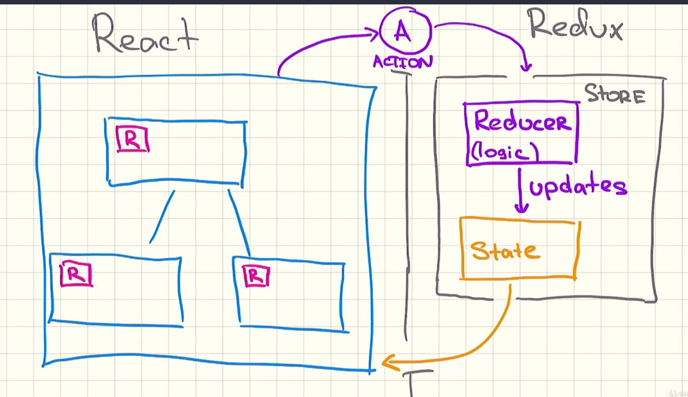

# Redux


Суть Redux - есть глобальный state + функции actions, которые меняют этот state (state + actions = store). Это всё находится в одном месте (reducer). Доступ к store компоненту предоставляет функция connect. Все данные из store можно прикручивать к props компонентов через методы mapStateToProps и mapDispatchToProps.

**Redux** - единый глобальный state всего приложения + Reducer. 
State в Redux все компоненты могут только читать, изменять его нельзя. 

**Reducer** - (Функция) вся логика по обновлению или изменению state. Reducer обновляет state. Реагирует на actions.

**Actions** - (Объекты) События (действия), которые могут создаваться в компонентах, для передачи в Reducer, чтобы обновить state. 

**Store** - (Объект) Центральный объект Redux. Обёртка Reducer и глобального state.  Изолирование всего Redux от остального кода.

**Dispatch** - (Функция) Передача actions в Store, чтобы обновить state

**mapStateToProps** - (Функция), которая вызывается из компонента, возвращает дынные из store (пробрасывает props в компонент). Какие данные внести компоненту в props из store.

**mapDispatchToProps** - какие actions внести компоненту из reducers в props.


## 1 шаг - Устанавливаем библиотеки
```npm i --save redux react-redux```

Для Redux-dev-tools:

```npm i --save-dev redux-thunk```

## 2 шаг - Создаём Redux-обёртку всего приложения
```js
import { Provider } from 'react-redux';

<Provider>
  <Router><App/></Router>
</Provider>
```
После этого каждый React-компонент может подключаться к глобальному store, с помощью функции <b>connect</b> 

## 3.1 шаг - Создаём Redux-store
```js
import { Provider as Redux } from 'react-redux';
import store from './store.js';

<Provider store={store}>
  <Router><App/></Router>
</Provider>
```

store это функция, которая принимает Reducer
```js
// store.js 
import { createStore } from 'redux';
import rootReducer from './reducer.js';

export default createStore(rootReducer);
```

## 3.2 шаг - Подключаем Redux-dev-tools
```npm i --save-dev redux-thunk```
```js
// store.js 
import { createStore, compose, applyMiddleware } from 'redux';
import rootReducer from './reducer.js';
import thunk from 'redux-thunk';

// with ReduxDevTools
const composeEnhancers = typeof window === 'object' &&
  window.__REDUX_DEVTOOLS_EXTENSION_COMPOSE__
  ? window.__REDUX_DEVTOOLS_EXTENSION_COMPOSE__({})
  : compose;

const enhancer = composeEnhancers(applyMiddleware(thunk));

export default createStore(rootReducer, enhancer);
```
В режиме разработке данный store также будет доступен Redux-dev-tools в браузере

## 4.1 шаг - Создаём Reducer
Reducer это самая главная функция в Redux, которая принимает начальный state и actions.
Actions это объект, имеющий много типов (types), при проверке которых и происходит изменение state.
Вся логика состояния приложения находится здесь. По умолчанию возвращает исходный(начальный) state.
```js
// reducer.js
import initialState from './initial-state.json';

const rootReducer = (state = initialState, action) => {
  switch (action.type) {

    // actions // 

    default: return state;
  }
}
```

## 4.2 шаг - Создаём Actions

## 4.3 шаг - Множественные Reducer-ы
```js
import { combineReducers } from 'redux'
import { pageReducer } from './pageReducer'
import { userReducer } from './userReducer'

export const rootReducer = combineReducers({
  page: pageReducer,
  user: userReducer,
})
```
